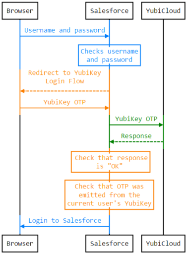
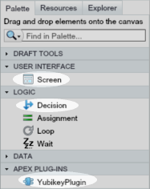
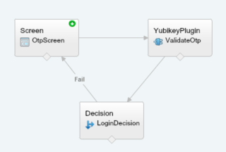
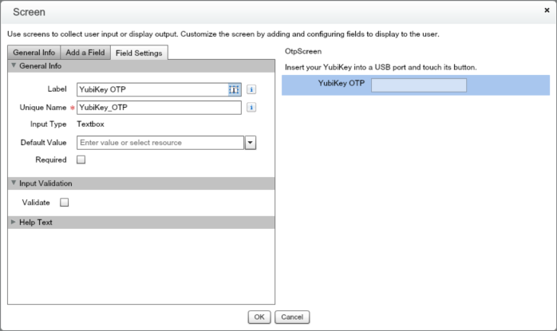
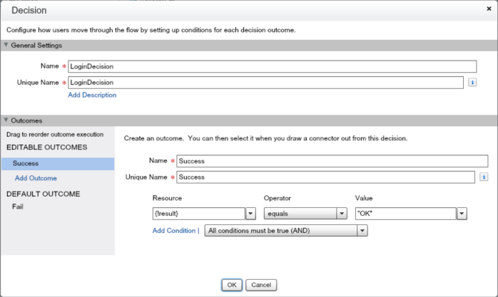

Login example
=============

This is an example of how to integrate the link:https://github.com/Yubico/yubikey-salesforce-client[yubikey-salesforce-client],
an Apex library for validating link:http://www.yubico.com/products/yubikey-hardware/yubikey/technical-description/[YubiKey One-Time Passwords], into your Salesforce organization.
This will enable the users in your Salesforce organization to use link:http://www.yubico.com/about/intro[YubiKeys] as a second factor when logging in.

> *NOTE:* If you prefer an off-the-shelf product, we recommend
using our link:http://yubico.com/salesforce[YubiKey for Salesforce app].

In order to allow users to login using their YubiKeys, we have to create:

 - A custom User Field holding the YubiKey ID of that user's YubiKey. 
 - A _Flow_.
 - An _Apex Plug-in_ allowing our Flow to query Apex code.
 - A link:https://help.salesforce.com/HTViewHelpDoc?id=security_login_flow.htm[_Login Flow_] that tells Salesforce to run our Flow when logging in users.

== Overview
In the diagram below is what we want to achieve. The blue parts are handled by Salesforce out-of-the-box, the green part covers what the _yubikey-for-salesforce_ library
can do for us, and the orange parts is what we are going to implement in this example.

== Custom User Field
To know what YubiKey is associated with a user, we have to create a custom field
holding the 12 character YubiKey ID.

 1. From setup, click *Customize | Users | Fields*.
 2. Click *New*.
 3. Select *Text*.
 4. Name your field _yubikeyId_ and set length to 12.

For the purpose of this example, set the yubikeyId of your own user to the first 12 characters
that is emitted when you touch your YubiKey.

== Apex Plug-in

An Apex plug-in is an Apex class that implements the link:https://www.salesforce.com/us/developer/docs/apexcode/Content/apex_process_plugin.htm[Process.Plugin] interface. Apex plug-ins
can be used by Flows to communicate with Apex code.

Below is an example of how you could implement an Apex plug-in that uses the link:https://github.com/Yubico/yubikey-salesforce-client/blob/master/src/classes/OtpValidator.cls[OtpValidator] class
from _yubikey-salesforce-client_ to validate YubiKey One-Time Passwords.

[source,java]
----
global class YubikeyPlugin implements Process.Plugin 
{
    private final OtpValidator validator = new OtpValidator();
   
    global Process.PluginResult invoke(Process.PluginRequest request) {   
        String otp = (String)request.inputParameters.get('otp'); 

        String result = validator.validate(otp);

	yubikeyID = otp.substring(0, 12); // The first 12 characters of an OTP is the YubiKey ID
	if(belongsToCurrentUser(yubikeyId)) {
		result = 'Wrong YubiKey for this user';
	}

        return new Process.PluginResult(new Map<String, Object>{ 'Result' => result }); 
    } 

    private Boolean belongsToCurrentUser(String yubikeyId) {
	String userId = UserInfo.getUserId();
	User currentUser = [SELECT yubikeyId__c FROM User WHERE id =: userId LIMIT 1];
	return currentUser.yubikeyId__c == yubikeyId;
    }
   
    global Process.PluginDescribeResult describe() { 
        Process.PluginDescribeResult result = new Process.PluginDescribeResult();  
        result.inputParameters = new List<Process.PluginDescribeResult.InputParameter> { 
            new Process.PluginDescribeResult.InputParameter('OTP', 
                Process.PluginDescribeResult.ParameterType.STRING, true)   
        }; 
        result.outputParameters = new List<Process.PluginDescribeResult.OutputParameter> { 
            new Process.PluginDescribeResult.OutputParameter('Result', 
                Process.PluginDescribeResult.ParameterType.STRING) 
        };        
        return result; 
    }
}
----

== Flow

To be able to create a Login Flow, we first need a Flow.

 1. From setup, click *Create | Workflow & Approvals | Flows*.
 2. Click *New Flow* to open the flow designer.

We will use three elements from the Flow Palette:

 - A _Screen_ in which the user enters the OTP.
 - The _YubikeyPlugin_ to validate the OTP entered in the screen.
 - A _Decision_ to decide, based upon the result from the plugin, whether to finish the flow or send the user back to the starting screen.  

Our goal is to end up with a Flow looking like this:

=== Starting screen
Create a new screen by dragging the *Screen* icon from the Palette to the canvas.
In the screen configuration, add a Textbox (in which the user can enter the OTP) and name it _YubiKey_OTP_.

Once you have created the screen, make it the starting element by clicking the green plus icon that
appears when hovering over it.

=== Apex Plug-in
Create a *YubikeyPlugin* and configure it like this:

==== Inputs
Set the value of the _otp_ input to YubiKey_OTP by clicking the dropdown menu followed by *SCREEN INPUT FIELDS | YubiKey_OTP*.

==== Outputs
Assign the _result_ value from the plug-in to a new variable called _result_. Do this by clicking the dropdown followed by *CREATE NEW | Variable*.

=== Decision
Create a *Decision* and configure it like this:

=== Tying it all together
Start dragging from the small diamond shaped connectors below each element to create arrows connecting the elements.
The arrows represents the execution path of the Flow. 

 - Screen -> YubikeyPlugin
 - YubikeyPlugin -> Decision
 - Decision -> Screen

When connecting the last arrow, you will be asked to select which decision outcome that should result in this path. Choose _Fail_.
This means that if the OTP was invalid (which will set the Decision outcome to _Fail_) the user will be sent back to the starting screen.

Note that we did not specify where to go if the Decision outcome is _Success_. When such an outcome (without an arrow associated to it) occurs
the flow will finish. This is exactly what we want since finishing the flow effectively logs the user in.

=== Testing and activating
Test the Flow by clicking *Run*. When the Flow works as expected, click *Save*, *Close* and then *Activate*. 

== Login Flow
It is time to configure Salesforce to run our flow when a user of a certain profile logs in.

> *WARNING:* Do not create a Login Flow for the System Administrator profile (until you're confident that things works the way
that you want) – you risk locking yourself out of Salesforce. Instead, create a test account
(remember to set the _yubikeyId__c_ field) that has another profile.

 1. From setup, click *Security Controls | Login Flows*.
 2. Click *New*.
 3. Associate the Flow that you just created with a Profile whose users you want to run the Flow during login.

That's it! The next time a user of that profile logs in to Salesforce, they will have to enter a valid YubiKey OTP.
